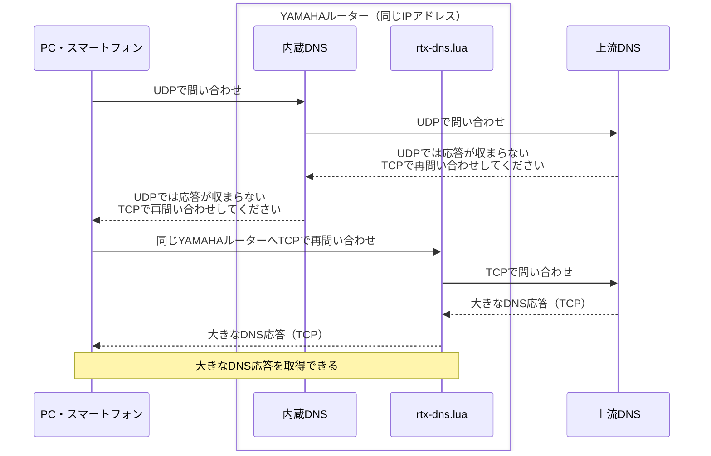
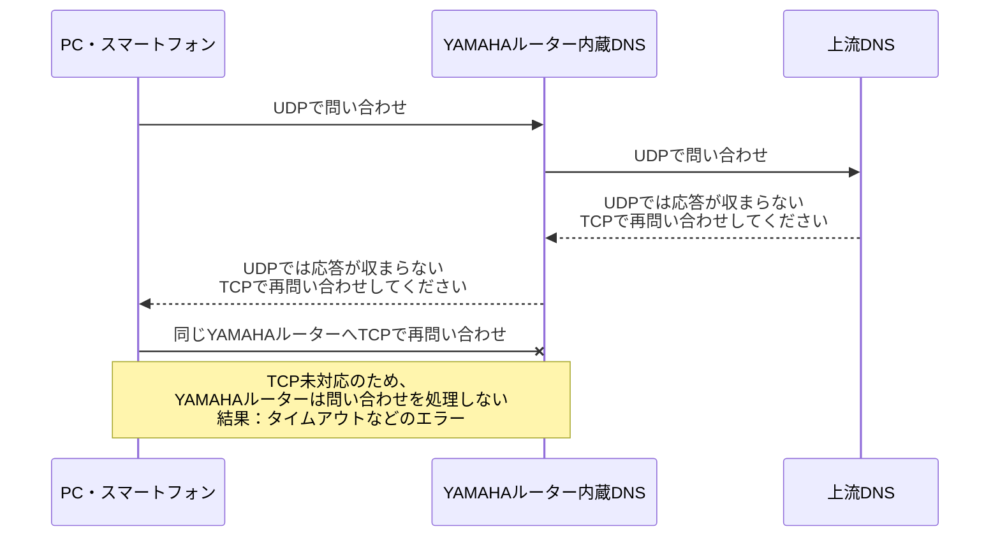

ソースコード・テスト・ドキュメントはすべてOpenAI Codexで生成した。

# YAMAHAルーターのDNSにTCPフォールバックを追加

**YAMAHAルーターをDNSサーバーとして使ったまま、UDPでは収まらない大きなDNS応答も受け取れるようにするLuaスクリプトです。** クライアント側のDNSサーバー設定を変えずに使えます。

- **TCPフォールバックに対応**：クライアントがUDPからTCPへ切り替えた問い合わせを、同じYAMAHAルーターのIPアドレスで受け付けます。[ヤマハ公式FAQで説明されている内蔵DNSのTCP未対応](https://www.rtpro.yamaha.co.jp/RT/FAQ/TCPIP/dns-recursive-server.html)を補います。
- **インストールは簡単**：配布ファイルの`rtx-dns.lua`をYAMAHAルーターへ転送し、起動コマンドを実行するだけ。追加ライブラリやビルドは不要です。自動起動もスケジュールコマンドで登録できます。
- **スクリプトの個別設定は不要**：上流DNS、問い合わせを許可する端末・LAN、簡易DNSの登録内容を、起動時にYAMAHAルーターの設定から自動で読み込みます。Luaファイルを編集する必要はありません。
- **既存の内蔵DNSと共存**：通常のUDP問い合わせは従来どおり内蔵DNSが処理します。登録済みの簡易DNSレコードも内蔵DNSへ問い合わせ、スクリプトがYAMAHAルーターの設定を書き換えることはありません。

[v0.9.9のダウンロード](https://github.com/Yamar50/rtx-dns-tcp-lua/releases/tag/v0.9.9) · [インストール手順](docs/install.md) · [動作が見込まれる機種・最低ファームウェア・動作確認](docs/compatibility.md)

## 動作が見込まれる機種と動作確認状況

**RTX・NVR・vRXシリーズに加え、FWX120も対象です。** [ヤマハ公式Lua機能対応表](https://www.rtpro.yamaha.co.jp/RT/docs/lua/index.html)とリリースノートを基に、必要なAPIを備える17機種・提供環境をまとめました。最低ファームウェアはAPIの条件で、実機確認した版とは別に記載しています。

| 機種・提供環境 | 最低ファームウェア（API条件） | 動作確認したファームウェア | 確認したスクリプト | 動作確認状況 |
|---|---|---|---|---|
| RTX840 | Rev.23.02.02 | — | — | 情報をお待ちしております |
| RTX3510 | Rev.23.01.01 | — | — | 情報をお待ちしております |
| RTX1300 | Rev.23.00.03 | Rev.23.00.19 | v0.1.2 | 協力者から動作報告あり |
| RTX1220 | Rev.15.04.01 | — | — | 情報をお待ちしております |
| RTX830 | Rev.15.02.01 | Rev.15.02.33 | v0.9.9 | 開発時に機能・負荷試験を実施。5台への配備を確認 |
| RTX1210 | Rev.14.01.11 | Rev.14.01.42 | v0.9.9 | 開発時に機能・負荷試験を実施。1台への配備を確認 |
| RTX5000 | Rev.14.00.18 | — | — | 情報をお待ちしております |
| RTX3500 | Rev.14.00.18 | — | — | 情報をお待ちしております |
| RTX810 | Rev.11.01.25 | — | — | 情報をお待ちしております |
| RTX1200 | Rev.10.01.65 | — | — | 情報をお待ちしております |
| NVR510 | Rev.15.01.02 | Rev.15.01.26 | v0.1.4-nvr.1＋PR #1の追加修正（`9402afc`） | 協力者から外部A・大型TXT・内蔵DNSの名前解決の動作報告あり |
| NVR700W | Rev.15.00.02 | — | — | 情報をお待ちしております |
| NVR500 | Rev.11.00.28 | — | — | 情報をお待ちしております |
| FWX120 | Rev.11.03.13 | — | — | 情報をお待ちしております |
| vRX VMware ESXi版 | Rev.20.01.03 | — | — | 情報をお待ちしております |
| vRX Amazon EC2版 | Rev.20.00.03 | — | — | 情報をお待ちしております |
| vRX さくらのクラウド版 | Rev.19.02.10 | — | — | 情報をお待ちしております |

**v0.9.9を実機検証した機種はRTX830・RTX1210です。** RTX1300とNVR510の報告は、表に記載した過去版・修正版に対するものです。負荷試験の条件と結果、機種ごとの制約、最低ファームウェアの根拠は[対応機種の管理表](docs/compatibility.md)を参照してください。

### 検出するインターフェース名

**不具合の報告や「この機種で動いた」という動作報告をいただけると嬉しいです。** [GitHub Issues](https://github.com/Yamar50/rtx-dns-tcp-lua/issues/new/choose)から「不具合の報告」または「動作の報告」を選んで、分かる範囲でご記入ください。

| 種類 | 検出する形式 | 例 |
|---|---|---|
| LAN | `lanN` | `lan1`、`lan2` |
| タグVLAN | `lanN/M` | `lan1/1` |
| LAN分割 | `lanN.M` | `lan1.1` |
| VLAN | `vlanN` | `vlan1` |
| WAN | `wan1` | `wan1` |
| ONU | `onu1` | `onu1` |
| ブリッジ | `bridge1` | `bridge1` |
| PP | `pp N`（専用構文） | `dns server pp 1` |

`N`・`M`は番号です。名前を検出できることと、各DNSコマンドで使えることは別です。たとえば`lanN.M`はアドレス読取りと`dns host lan`の対象に含めますが、直接の`dns host lanN.M`やDHCPによるDNS取得元には対応していません。詳しくは[用途別の対応表](docs/compatibility.md#interface-forms)を参照してください。

**一覧にないインターフェース名を使用していて、起動や名前解決に失敗する場合は、[GitHub Issues](https://github.com/Yamar50/rtx-dns-tcp-lua/issues)でお知らせください。Luaコードを調べたり修正したりする必要はありません。** GitHubにログインし、**Issues → New issue**で報告の種類を選び、フォームに記入して送信できます。 機種名・ファームウェアRev.・スクリプトの版・`DNSRELAY`のエラーログ・該当するDNS設定行を添えてください。パスワードなどの認証情報は記載せず、IPアドレスやホスト名も必要に応じて伏せてください。起動失敗にはAPIやアクセス許可設定など別の原因もあるため、一覧内の名前で失敗する場合も同じ情報が役立ちます。

## v0.9.9の主な変更点

- **YAMAHA NVRのONUやタグVLANなどの設定に対応**：インターフェース名の判定を共通化し、未対応のDNS取得元があっても、選択条件を解釈できる場合は無関係な規則の問い合わせを継続します。
- **IPv6とIPv4でDNSの経路が異なる環境に対応**：一致した規則のDNSがIPv6のみの場合は、条件に合う後続のselect規則、次に通常DNSのIPv4を使います。DNS取得状態が不明な規則や明示拒否は迂回しません。 [DNS選択の詳細](https://github.com/Yamar50/rtx-dns-tcp-lua/blob/main/docs/dns-ipv6-fallback.md)
- **機種ごとのAPI差と異常時の処理を整理**：必要なAPIを確認し、初期化失敗時のソケット解放、ログ失敗の隔離、待機できない場合の停止を追加しました。

v0.9.9はRTX830・RTX1210で、各32項目の機能回帰と各7スイート・2,738チェックの整数版Luaによる解析試験に成功しました。さらにRTX830の5台とRTX1210の1台へ配備し、実際の設定と5つの仮想IPを含む計75件の確認に成功しています。[検証結果](docs/validation.md#v099-validation)

v0.9.9はv1.0.0に向けた確認用の版です。複数機種での通常利用の結果を確認し、必要に応じて軽微な不具合を修正してからv1.0.0へ進みます。[変更内容と検証結果](docs/releases/v0.9.9.md)・[DNS選択の技術仕様](docs/dns-ipv6-fallback.md)


## ビルド済みファイルからの導入

[v0.9.9 Release](https://github.com/Yamar50/rtx-dns-tcp-lua/releases/tag/v0.9.9)のAssetsにある`rtx-dns.lua`は、そのままYAMAHAルーターへ転送して使うための配布ファイルです。Luaファイルの手編集や手元でのビルドは不要です。

起動時に`dns host`からアクセス許可、`ip host`／`dns static`からローカルの登録名、`dns server select`／`dns server`／`dns server pp`／`dns server dhcp`から上流DNSを選びます。PP・DHCPで取得したDNSは30秒ごとに更新します。TCP/53で待ち受け、256件のキャッシュを使い、終了時間を設けずに動作します。`dns host any`または省略時は、YAMAHAルーターの既定値どおり全ホストを許可します。

USBメモリやmicroSDカード、SFTP等でインストールします。機種が備える転送方法を使用してください。`/lua/rtx-dns.lua`へコピーした後は、次のコマンドで開始できます。初回の`100`は未使用のスケジュール番号に置き換え、更新時は既存のスケジュールを使用します。

**更新時はコピー前に旧スクリプトを停止します。** NVR試験版からの移行も含め、[更新手順](docs/install.md#update-script)を参照してください。

```text
lua /lua/rtx-dns.lua
schedule at 100 startup * lua /lua/rtx-dns.lua
save
```

手動起動の代わりに、スケジュールを保存してYAMAHAルーターを再起動しても開始できます。USBメモリからの転送、構文確認、更新・停止までの手順は[インストールと起動](docs/install.md)を参照してください。

## このスクリプトがあると…

**大きなDNS応答も、これまでと同じYAMAHAルーターから受け取れます。** 以下は、上流DNSの応答がUDPで送れるサイズを超える場合の例です。上流DNSは「UDPでは応答が収まらないので、TCPで再問い合わせしてください」という意味の通知（`TC=1`）を返します。これを受けたクライアントがTCPで問い合わせ直します。



UDPからTCPへの切り替えはクライアントが行い、そのTCP問い合わせをLuaが受け付けます。

## このスクリプトがないと…

**TCPで問い合わせ直しても、YAMAHAルーター内蔵DNSでは大きな応答を受け取れません。** TCPで問い合わせ直すよう通知を受け取るところまでは同じ流れですが、その先のTCP問い合わせを受け付ける機能がありません。



通常のUDP問い合わせは、スクリプトの有無にかかわらず内蔵DNSが処理します。YAMAHAルーターに登録した簡易DNSのレコードも引き続き利用できます。TCPで問い合わせ直す動作は[RFC 7766](https://www.rfc-editor.org/rfc/rfc7766.html#section-4)に、内蔵DNSのTCP未対応は[ヤマハ公式FAQ](https://www.rtpro.yamaha.co.jp/RT/FAQ/TCPIP/dns-recursive-server.html)に説明があります。

## 秒間クエリ数の目安と検証機種

配布版は、**送信元IPごとに平均20クエリ/秒・同時4接続**を既定の制限としています。これは保護のための値で、機器の限界性能ではありません。通常のUDP問い合わせは内蔵DNSが処理し、LuaはTCPへ切り替えた問い合わせを受け持ちます。

v0.9.9では、LAN内の合成DNSから最大長65,535バイトの応答を返し、1つの送信元IPから新しいTCP接続で問い合わせる次の試験を行いました。既定の制限はすべて維持しています。

| 機種・ファームウェア | 台数 | 毎秒20件を30秒間送った結果 |
|---|---:|---|
| RTX830 Rev.15.02.33 | 3台 | 各600/600件成功 |
| RTX1210 Rev.14.01.42 | 1台 | 600/600件成功 |

同じ4台に毎秒160件を送る過負荷試験では、制限による接続拒否などと、その後の正常な名前解決を確認し、再起動は観測しませんでした。応答サイズ、レコード数、上流DNSの待ち時間、ルーターの他の処理によって性能は変わります。

**別に実施した限界負荷試験では、通常の配布版とは異なり、負荷をかけるため送信元IPごとの保護制限を大幅に緩めました。** 同時接続数を4→32、平均クエリ数を20→1,000件/秒、バーストを40→1,000件に変更した条件で、RTX830に自己再起動が1回発生しました。全体32接続の制限は残しており、すべての制限を撤廃した試験ではありません。配布ファイルにはこの緩和を適用していません。[条件別の負荷試験結果](docs/load-test-v0.9.9.md)

v0.1.3の毎秒250件などの測定値は[過去版の負荷試験](docs/load-test-v0.1.3.md)として残し、v0.9.9の性能値とは区別しています。

## 実装内容

- 上流接続は固定設定で最大2本、YAMAHAルーターの規則を読み込む設定では既定で最大4本。同じ宛先の接続を規則間で共有します。1接続あたり4件のパイプライン、ID変換、順不同応答、部分送受信に対応。応答は最大65,535バイト。
- Lua起動時に稼働中configの `dns service` を確認し、recursiveならDNS設定を自動で読み取り、番号順に問い合わせ名・タイプ・元クライアントIPv4・`restrict pp`で選択します。`dns service fallback on/off`は起動を妨げません。
- キャッシュは最大256件・本文合計1MiB・TTL管理フィールド合計4,096個。参照時に期限確認し、容量不足時はLRUで追い出します。選択規則ごとにキーを分け、256件・1MiBの上限は全規則で共有します。毎秒の全件走査は行いません。
- キャッシュヒットではID、質問の大文字小文字、残りTTLを更新。正の通常応答のみ保存し、NXDOMAIN、NODATA、TTL=0、DNSSEC/特別なEDNSなどは保存しません。
- 接続試行は全体で平均毎秒1回、バースト2回まで。宛先別の待機は1→2→4→8→16→30秒。ソケット・送信元アドレス不足では新規接続を全体で30秒休止します。
- クライアント接続の受け入れに失敗した場合も1秒待機し、読み取り可能な待受ソケットを繰り返し処理する空回りを防ぎます。
- 同時クライアント32本、未完了問い合わせ32件、問い合わせ全体5秒、再試行1回。キャッシュと家庭内DNSは上流の回復待ちから独立しています。
- 送信元IPごとにTCP接続は4本、問い合わせは平均20件/秒・バースト40件まで。同じIPの全接続で合算し、キャッシュ・ローカル名・不正な問い合わせも数えます。切断・再接続しても利用枠はリセットしません。

接続数超過時は新しい接続を切断します。クエリ数超過時はその問い合わせにSERVFAILを返し、受け付け済みの処理・応答を既存の期限内で完了してから接続を閉じます。問い合わせ枠が回復するまで新しい接続も拒否します。送信元の管理表は最大256 IPで、満杯時は接続がなく利用枠が全回復したIPだけを入れ替えます。安全に入れ替えられなければ、新しいIPからの接続を拒否します。

この制限はLuaが受け付けるTCP問い合わせに適用します。YAMAHAルーター内蔵DNSのUDP問い合わせには適用しません。NATや別のDNS中継サーバー経由で複数端末が同じ送信元IPに見える場合は、そのIP全体で上限を共有します。20件/秒は保護のための既定値で、機器の限界性能ではありません。これらの制限値はファイルの手編集なしで有効になります。

最終的に解決できない問い合わせはSERVFAILを返して処理を終了します。その後の再問い合わせやDNSサーバーの選択は、クライアント側に委ねます。

上限を超えた応答はキャッシュを省略して中継します。キャッシュ本文の1MiBはLua全体のメモリ上限ではありません。管理情報・処理中のメッセージもメモリを使います。

確認した機種と機能は [検証範囲](docs/validation.md) を参照してください。

## ソースからのビルドとテスト

ビルドはPython 3の標準ライブラリだけを使用します。ローカルの単体テストにはLuaも必要です。生成物は1本のLuaファイルで、YAMAHAルーターへの追加ライブラリのインストールは不要です。

```sh
lua tests/test_interfaces.lua
lua tests/test_wire_cache.lua
lua tests/test_dns_policy.lua
lua tests/test_dynamic_policy.lua
lua tests/test_ipv6_fallback.lua
lua tests/test_dns_runtime.lua
lua tests/test_aaaa_filter.lua
lua tests/test_auto_config.lua
lua tests/test_nvr_compat.lua
lua tests/test_policy_wire.lua
lua tests/test_main.lua
lua tests/test_relay.lua
lua tests/cache_memory.lua
python3 -m unittest discover -s tests -p 'test_*.py'
python3 tools/build.py --config config/release.lua --output build/release/rtx-dns.lua
```

`make test` / `make release` も利用できます。上記のビルドは、Releaseと同じ自動設定プロファイルを使います。YAMAHAルーターは整数版Luaなので、小数の数値リテラル、32bit符号付き整数を超える直接計算、標準LuaSocket前提のコードを追加しないでください。

## YAMAHAルーターのconfigからの自動設定

配布版では`allowed_clients`、`local_dns_host`、`local_zones`などを編集する必要はありません。`dns host`から許可する端末・LANを、`ip host`・`dns static`からローカル登録名を読み取ります。内蔵DNSの問い合わせ先も自動で選びます。

待受は全IPv4アドレスのTCP/53です。VRRPの仮想IPは、そのルーターがMASTERになっているアドレスで利用します。アクセス許可はYAMAHAルーター側の`dns host`に従います。

配布版は起動時に、`rt.command("show config")` の結果を読みます。`dns service recursive`ならDNSの転送規則を使い、`dns service off`なら起動を中止してTCP待受を開始しません。サービス指定の省略時は、YAMAHAルーターの既定値に従いrecursiveとして扱います。**`dns server`、`dns server select`、`dns host`、`dns service`、ホスト登録などの設定を変更した後は、このLuaスクリプトを再起動してください。起動スケジュールを登録済みであれば、変更したconfigを`save`してYAMAHAルーター本体を再起動する方法でも反映されます。稼働中のLuaはconfigを自動再読込しません。**

設定全体をログへ出力せず、ルーターのconfigを変更しません。

`dns server select`を小さい番号から評価します。固定IP、PP取得、DHCP取得、rejectに対応し、元クライアントの送信元IPv4、問い合わせタイプ、PTRのIPv4/プレフィックス、`restrict pp`、`edns=on/off`を扱います。EDNS省略時はヤマハの既定どおりoffです。**一致した規則がIPv6のみで利用できない場合に限り、条件に合う後続select、次に通常DNSのIPv4を使います。** 選んだIPv4 DNSへの接続失敗・タイムアウトでは、後続規則へ選び直しません。

通常DNSの優先順位は、固定の`dns server`、`dns server pp`、NVRの`dns server pdp`、`dns server dhcp`です。PDPからのDNS取得は未対応であり、PDPが通常DNSとして選ばれる問い合わせはSERVFAILにします。優先する固定DNSやPPがある場合はそちらを使い、未対応PDPを理由に下位DHCPへ送りません。[選択仕様](docs/dns-policy.md)

PP・DHCPの状態は起動時と30秒ごとに確認します。接続先や選択状態が変わった場合は、古い接続とキャッシュを破棄し、処理中の問い合わせにはSERVFAILを返します。これは取得済みDNSの更新であり、config変更の自動再読込ではありません。

複数のIPv4インターフェースがDHCPを利用していて取得DNSを各インターフェースに対応付けられない場合は、該当規則への問い合わせをSERVFAILにします。取得元不明や状態取得失敗を「DNS未取得」と扱って別のDNSに送ることはしません。[選択規則と例外時の詳細](docs/dns-policy.md)

`edns=off`では上流向けのOPT（DOやオプションを含む）を除去します。DNSSEC関連・特別なEDNS要求をキャッシュしない方針は維持します。`edns=on`では既存OPTを保持し、OPTのない要求には空OPTを追加します。これにより、以前の固定設定の透明中継と応答内容が変わる場合があります。

`select ... reject`はPTRも含め、該当する問い合わせを破棄します。NAT46などの未対応規則、判定不能な取得元・条件は、該当する問い合わせにSERVFAILを返します。IPv6のみの規則から後続へ進んでも利用可能な宛先がなければSERVFAILです。未対応構文を無条件に読み飛ばしません。条件を解釈できない規則では、その番号で該当する可能性がある問い合わせを止めます。重複規則番号・入力上限超過・不明なアクセス許可などは起動エラーになります。最大256規則・異なる上流宛先16個までです。

`dns service aaaa filter on`では、外部へのAAAA問い合わせの応答からAAAAと対応するRRSIGを除去し、CNAMEなどを保持します。加工した応答のADは解除し、キャッシュには保存しません。登録済みの簡易DNS名は従来どおり内蔵UDP DNSへ渡し、内蔵側のフィルターに従います。

インターフェースは`lanN`・`lanN/M`・`lanN.M`・`vlanN`・`wan1`・`onu1`・`bridge1`を用途別に分類し、PPは`pp N`の専用構文で扱います。`dns host lan`にWAN・ONUを含めません。`lanN.M`はアドレスの読取りとLAN一括指定では扱いますが、未確認の直接指定`dns host lanN.M`や`dns server dhcp lanN.M`は使用しません。[用途ごとの対応表](docs/compatibility.md#interface-forms)

配布版はYAMAHAルーターの静的登録名を起動時に読み取り、その名前への問い合わせを内蔵UDP DNSに渡します。親ドメインや子孫の名前までローカル扱いにはしません。ホスト名とIPの対応をLuaに複製して応答する処理は行いません。内蔵DNSへのUDP受信上限は2,048バイトです。EDNSがある要求は2,048を超える広告サイズだけ縮小し、DO/CDやその他の情報を保持します。不完全な応答やTCP再問い合わせ要求（TC=1）ではSERVFAILを返し、登録名を外部DNSへ転送しません。

開発・検証のために手動設定を使う場合の手順は、[開発・検証用の手動設定と一時実行](docs/development.md)にまとめています。通常の導入には不要です。

## 対応範囲と制限

- 通常のINクラスQUERYを対象とし、IN以外はFORMERRで拒否します。1メッセージ1質問、既定の問い合わせ上限4,096バイト。完全なDNSリゾルバーやdnsmasqの全機能ではありません。
- DNS UPDATE、AXFR/IXFR、TSIG/SIG(0)、EDNS TCP Keepaliveは拒否します。DNSSEC検証自体は行わず、対応する上流の回答を中継します。
- DNSSEC、CD/AD、ECS、COOKIEなどの特別な応答はキャッシュを避けます。通常中継では未知RRのデータを変更しません。AAAAフィルターで再構築が必要な応答に未対応RRが残る場合は、安全に加工できないためSERVFAILにします。
- IPv4の待受・上流を対象とします。IPv6接続、TLS、HTTPS、稼働中の家庭内ホスト登録の自動同期は含みません。
- 過負荷時はSERVFAILまたは接続失敗になります。クライアントのTCP接続待ち時間は、完全な問い合わせ受信後に始まる5秒の期限には含まれません。
- 期限判定はYAMAHAルーターの起動後経過秒数に基づき、秒単位です。
- 性能は上流DNSの待ち時間・応答サイズ・他のルーター処理によって変わります。機種共通の最大リクエスト数は定めていません。

## ファイル構成

- `src/`：DNS wire処理、キャッシュ、DNS選択規則、TCPリレー、起動処理。
- `config/release.lua`：転送・起動だけで利用する配布版の自動設定プロファイル。
- `config/example.lua`：開発・検証専用のループバック限定・120秒の手動設定。
- `tools/build.py`：単一Luaファイルへの結合。
- `tools/serve_artifact.py`：生成物1ファイルの一時配布。
- `tests/`：単体テスト、合成DNSサーバー、負荷・障害試験用ハーネス。
- `tools/summarize_run.py` / `tools/plot_load.py`：測定結果の集計・描画。描画のみMatplotlibが必要です。

## 過去の変更履歴

- [v0.1.4：レコード数の多い応答の送信期限を修正](docs/releases/v0.1.4.md)
- [v0.1.3：キャッシュ・TCP半閉鎖・DNSクラスの処理を修正](docs/releases/v0.1.3.md)
- [v0.1.2：PP・DHCP取得DNSとDNS設定解析に対応](docs/releases/v0.1.2.md)

## ライセンスと免責事項

このリポジトリには、MITなどのソフトウェアライセンスを設定していません。生成方法と既存OSSとの照合結果は[コードの来歴と確認範囲](docs/code-provenance.md)を参照してください。


本ソフトウェアは現状のまま提供します。動作、正確性、特定の目的への適合性を保証しません。利用者自身の責任で使用してください。本ソフトウェアの使用または使用不能によって生じた損害について、提供者は法令で認められる範囲において一切の責任を負いません。

## 参照資料

- [IPv6のみの上流DNSが選ばれた場合のIPv4 DNSへの切替仕様](docs/dns-ipv6-fallback.md)
- [Yamaha Lua機能](https://www.rtpro.yamaha.co.jp/RT/docs/lua/)
- [dns service](https://www.rtpro.yamaha.co.jp/RT/manual/rt-common/dns/dns_service.html)
- [dns server select](https://www.rtpro.yamaha.co.jp/RT/manual/rt-common/dns/dns_server_select.html)
- [dns server](https://www.rtpro.yamaha.co.jp/RT/manual/rt-common/dns/dns_server.html)
