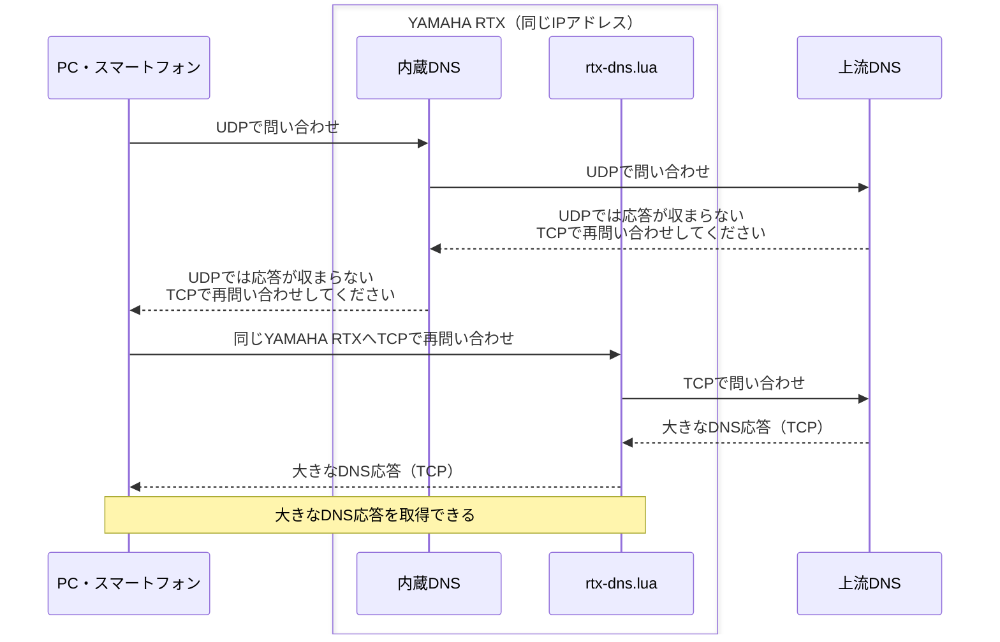
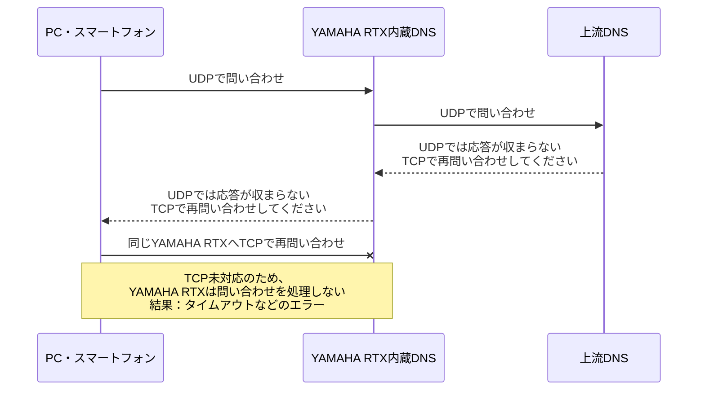

ソースコード・テスト・ドキュメントはすべてOpenAI Codexで生成した。

# YAMAHAのRTXルーターのDNSにTCPフォールバックを追加

**YAMAHA RTXをDNSサーバーとして使ったまま、UDPでは収まらない大きなDNS応答も受け取れるようにするLuaスクリプトです。** クライアント側のDNSサーバー設定を変えずに使えます。

- **TCPフォールバックに対応**：クライアントがUDPからTCPへ切り替えた問い合わせを、同じYAMAHA RTXのIPアドレスで受け付けます。[ヤマハ公式FAQで説明されている内蔵DNSのTCP未対応](https://www.rtpro.yamaha.co.jp/RT/FAQ/TCPIP/dns-recursive-server.html)を補います。
- **インストールは簡単**：配布ファイルの`rtx-dns.lua`をYAMAHA RTXへ転送し、起動コマンドを実行するだけ。追加ライブラリやビルドは不要です。自動起動もスケジュールコマンドで登録できます。
- **スクリプトの個別設定は不要**：上流DNS、問い合わせを許可する端末・LAN、簡易DNSの登録内容を、起動時にYAMAHA RTXの設定から自動で読み込みます。Luaファイルを編集する必要はありません。
- **既存の内蔵DNSと共存**：通常のUDP問い合わせは従来どおり内蔵DNSが処理します。登録済みの簡易DNSレコードも内蔵DNSへ問い合わせ、スクリプトがYAMAHA RTXの設定を書き換えることはありません。

[ダウンロード（GitHub Releases）](https://github.com/Yamar50/rtx-dns-tcp-lua/releases/latest) · [インストール手順](docs/install.md)

## このスクリプトがあると…

**大きなDNS応答も、これまでと同じYAMAHA RTXから受け取れます。** 以下は、上流DNSの応答がUDPで送れるサイズを超える場合の例です。上流DNSは「UDPでは応答が収まらないので、TCPで再問い合わせしてください」という意味の通知（`TC=1`）を返します。これを受けたクライアントがTCPで問い合わせ直します。



UDPからTCPへの切り替えはクライアントが行い、そのTCP問い合わせをLuaが受け付けます。上流DNSはYAMAHA RTXの設定から選びます。

## このスクリプトがないと…

**TCPで問い合わせ直しても、YAMAHA RTX内蔵DNSでは大きな応答を受け取れません。** TCPで問い合わせ直すよう通知を受け取るところまでは同じ流れですが、その先のTCP問い合わせを受け付ける機能がありません。



通常のUDP問い合わせは、スクリプトの有無にかかわらず内蔵DNSが処理します。YAMAHA RTXに登録した簡易DNSのレコードも引き続き利用できます。TCPで問い合わせ直す動作は[RFC 7766](https://www.rfc-editor.org/rfc/rfc7766.html#section-4)に、内蔵DNSのTCP未対応は[ヤマハ公式FAQ](https://www.rtpro.yamaha.co.jp/RT/FAQ/TCPIP/dns-recursive-server.html)に説明があります。

## v0.1.4の主な修正点

- 約4,000件のAレコードを含む約64KBの応答で、単発の問い合わせでも応答送信前に接続が閉じる問題を修正しました。
- **既定の送信タイムアウトは2秒のまま**、期限の起点を応答の準備完了時に変更しました。解析・加工にかかった時間で送信期限を消費しないようにしています。
- YAMAHA RTX830・YAMAHA RTX1210で各29項目、計58項目の回帰試験に成功しました。キャッシュ、接続・クエリ数制限、TCP半閉鎖、上流障害からの復帰も確認しています。

変更内容・検証結果・更新手順は、[v0.1.4の解説](docs/releases/v0.1.4.md)と[GitHub Release](https://github.com/Yamar50/rtx-dns-tcp-lua/releases/tag/v0.1.4)をご覧ください。部分送信で期限を延ばす動作や、既定の利用制限の変更はありません。レコード数の多い応答を同時に複数処理した場合は、上流応答の期限に達することがあります。[確認した制約](docs/known-issues.md)

## v0.1.3の主な修正点

v0.1.2で確認した次の3点を修正しました。

- 問い合わせ名からCNAMEをたどり、要求された種類の回答がある場合だけキャッシュへ保存します。無関係な名前の回答では保存しません。
- 同じTCP接続で5件以上の要求をまとめて送り、送信側だけを閉じた場合も、受信済みの完全な要求を処理して応答を返します。既存の利用制限と処理期限は引き続き適用します。
- IN以外のDNSクラスはFORMERRで拒否し、上流や内蔵DNSへ転送しません。

変更内容・検証結果・更新手順は、[v0.1.3の解説](docs/releases/v0.1.3.md)と[GitHub Release](https://github.com/Yamar50/rtx-dns-tcp-lua/releases/tag/v0.1.3)をご覧ください。既定の接続数・問い合わせ数制限は変更していません。[v0.1.2の問題の記録](docs/known-issues.md)と[PP・DHCP対応の解説](docs/releases/v0.1.2.md)も残しています。

## 概要

このリポジトリには、MITなどのソフトウェアライセンスを設定していません。生成方法と既存OSSとの照合結果は [コードの来歴と確認範囲](docs/code-provenance.md) を参照してください。

YAMAHA RTXの内蔵UDP DNSと静的ホスト登録を維持し、LuaでTCP DNSを補完します。開発時の実機検証対象は **YAMAHA RTX830 Rev.15.02.33** と **YAMAHA RTX1210 Rev.14.01.42**、どちらも整数版Lua 5.1.5（機能1.08）です。**YAMAHA RTX1300 Rev.23.00.19については、協力者からv0.1.2の`rtx-dns.lua`での動作確認報告をいただいています。** v0.1.3・v0.1.4の実機検証には含めていません。YAMAHA RTX810は未検証です。[動作確認一覧](docs/validation.md#実機)

```text
クライアント ── UDP/53 ── YAMAHA RTX内蔵DNS
             └─ TCP/53 ── Lua
                          ├─ YAMAHA RTXに登録した簡易DNSのレコードと完全一致 → YAMAHA RTX内蔵DNS（UDP）
                          └─ その他 → 上流DNS（TCP接続を再利用）
```

クライアントがUDPの切り詰め応答を受けてTCPへ再問い合わせする場合に、同じYAMAHA RTXのIPでTCP問い合わせを受け付ける構成です。Luaが内蔵DNSの上流通信を捕捉する仕組みではありません。YAMAHA RTX内蔵DNSをTCPで補完し、大きなDNS応答をクライアントへ返せるようにするのが、このスクリプトの目的です。

## ビルド済みファイルからの導入

[Releases](https://github.com/Yamar50/rtx-dns-tcp-lua/releases)の`rtx-dns.lua`は、そのままYAMAHA RTXへ転送して使うための配布ファイルです。Luaファイルの手編集や手元でのビルドは不要です。

起動時に`dns host`からアクセス許可、`ip host`／`dns static`からローカルの登録名、`dns server select`／`dns server`／`dns server pp`／`dns server dhcp`から上流DNSを選びます。PP・DHCPで取得したDNSは30秒ごとに更新します。TCP/53で待ち受け、256件のキャッシュを使い、終了時間を設けずに動作します。`dns host any`または省略時は、YAMAHA RTXの既定値どおり全ホストを許可します。

USBメモリやmicroSDカード、SFTP等でインストールします。`/lua/rtx-dns.lua`へコピーした後は、次のコマンドで開始できます。`100`は未使用のスケジュール番号に置き換えます。

```text
lua /lua/rtx-dns.lua
schedule at 100 startup * lua /lua/rtx-dns.lua
save
```

手動起動の代わりに、スケジュールを保存してYAMAHA RTXを再起動しても開始できます。USBメモリからの転送、構文確認、更新・停止までの手順は[インストールと起動](docs/install.md)を参照してください。

## 秒間クエリ数の目安と検証機種

**v0.1.3をYAMAHA RTX830 Rev.15.02.33・YAMAHA RTX1210 Rev.14.01.42で測定しました。** LAN内の合成上流DNSを使い、キャッシュなし・問い合わせごとに新しいTCP接続を作る条件で、次の各30秒の試験は予定した全件が正常応答でした。

| 応答サイズ（単一TXTレコード） | YAMAHA RTX830 | YAMAHA RTX1210 |
|---|---|---|
| 512バイト | 250クエリ/秒、7,500 / 7,500件成功 | 100クエリ/秒、3,000 / 3,000件成功 |
| 65,535バイト | 40クエリ/秒、1,200 / 1,200件成功 | 40クエリ/秒、1,200 / 1,200件成功 |

64個の送信元IPを使い、配布版のIP当たり4接続・20クエリ/秒・バースト40件、全体32接続などの制限は維持しました。上流へのTCP接続は再利用しています。機種共通の最大性能や長時間の保証値ではなく、v0.1.3で全件成功した試験条件です。v0.1.4では機能回帰試験を行い、この負荷条件は再測定していません。

v0.1.3では同程度のサイズでもレコード数の多い応答が送信前に失敗しました。v0.1.4では、この問題を修正し、4,000件のAレコード・64,067バイトの応答を両機種で単発5件ずつ正常受信しました。[v0.1.4の検証結果](docs/validation.md#v014-validation)

より高い負荷、継続接続、キャッシュ、CPU・メモリ、YAMAHA RTX1210のLAN1受信オーバーフローを含む過去の結果は[v0.1.3の追加負荷試験報告](docs/load-test-v0.1.3.md)に記載しています。

公開前に実施した別条件の試験や、`dns server select`対応前のYAMAHA RTX830での100クエリ/秒・1時間の測定は[検証範囲と過去の測定](docs/validation.md)に残しています。v0.1.3で1時間の試験は再実施していません。

## 実装内容

- 上流接続は固定設定で最大2本、YAMAHA RTXの規則を読み込む設定では既定で最大4本。同じ宛先の接続を規則間で共有します。1接続あたり4件のパイプライン、ID変換、順不同応答、部分送受信に対応。応答は最大65,535バイト。
- Lua起動時に稼働中configの `dns service` を確認し、recursiveならDNS設定を自動で読み取り、番号順に問い合わせ名・タイプ・元クライアントIPv4・`restrict pp`で選択します。`dns service fallback on/off`は起動を妨げません。
- キャッシュは最大256件・本文合計1MiB・TTL管理フィールド合計4,096個。参照時に期限確認し、容量不足時はLRUで追い出します。選択規則ごとにキーを分け、256件・1MiBの上限は全規則で共有します。毎秒の全件走査は行いません。
- キャッシュヒットではID、質問の大文字小文字、残りTTLを更新。正の通常応答のみ保存し、NXDOMAIN、NODATA、TTL=0、DNSSEC/特別なEDNSなどは保存しません。
- 接続試行は全体で平均毎秒1回、バースト2回まで。宛先別の待機は1→2→4→8→16→30秒。ソケット・送信元アドレス不足では新規接続を全体で30秒休止します。
- クライアント接続の受け入れに失敗した場合も1秒待機し、読み取り可能な待受ソケットを繰り返し処理する空回りを防ぎます。
- 同時クライアント32本、未完了問い合わせ32件、問い合わせ全体5秒、再試行1回。キャッシュと家庭内DNSは上流の回復待ちから独立しています。
- 送信元IPごとにTCP接続は4本、問い合わせは平均20件/秒・バースト40件まで。同じIPの全接続で合算し、キャッシュ・ローカル名・不正な問い合わせも数えます。切断・再接続しても利用枠はリセットしません。

接続数超過時は新しい接続を切断します。クエリ数超過時はその問い合わせにSERVFAILを返し、受け付け済みの処理・応答を既存の期限内で完了してから接続を閉じます。問い合わせ枠が回復するまで新しい接続も拒否します。送信元の管理表は最大256 IPで、満杯時は接続がなく利用枠が全回復したIPだけを入れ替えます。安全に入れ替えられなければ、新しいIPからの接続を拒否します。

この制限はLuaが受け付けるTCP問い合わせに適用します。YAMAHA RTX内蔵DNSのUDP問い合わせには適用しません。NATや別のDNS中継サーバー経由で複数端末が同じ送信元IPに見える場合は、そのIP全体で上限を共有します。20件/秒は保護のための既定値で、機器の限界性能ではありません。これらの制限値はファイルの手編集なしで有効になります。

最終的に解決できない問い合わせはSERVFAILを返して処理を終了します。その後の再問い合わせやDNSサーバーの選択は、クライアント側に委ねます。

上限を超えた応答はキャッシュを省略して中継します。キャッシュ本文の1MiBはLua全体のメモリ上限ではありません。管理情報・処理中のメッセージもメモリを使います。

確認した機種と機能は [検証範囲](docs/validation.md) を参照してください。

## ソースからのビルドとテスト

ビルドはPython 3の標準ライブラリだけを使用します。ローカルの単体テストにはLuaも必要です。生成物は1本のLuaファイルで、YAMAHA RTXへの追加ライブラリのインストールは不要です。

```sh
lua tests/test_wire_cache.lua
lua tests/test_dns_policy.lua
lua tests/test_dynamic_policy.lua
lua tests/test_dns_runtime.lua
lua tests/test_aaaa_filter.lua
lua tests/test_auto_config.lua
lua tests/test_policy_wire.lua
lua tests/test_main.lua
lua tests/test_relay.lua
lua tests/cache_memory.lua
python3 -m unittest discover -s tests -p 'test_*.py'
python3 tools/build.py --config config/release.lua --output build/release/rtx-dns.lua
```

`make test` / `make release` も利用できます。上記のビルドは、Releaseと同じ自動設定プロファイルを使います。macOSでmakeがXcodeのライセンス確認に止まる場合は、上記の直接コマンドを使用できます。YAMAHA RTXは整数版Luaなので、小数の数値リテラル、32bit符号付き整数を超える直接計算、標準LuaSocket前提のコードを追加しないでください。

## YAMAHA RTXのconfigからの自動設定

配布版では`allowed_clients`、`local_dns_host`、`local_zones`などを編集する必要はありません。`dns host`から許可する端末・LANを、`ip host`・`dns static`からローカル登録名を読み取ります。内蔵DNSの問い合わせ先も自動で選びます。

待受は全IPv4アドレスのTCP/53です。VRRPの仮想IPは、そのルーターがMASTERになっているアドレスで利用します。アクセス許可はYAMAHA RTX側の`dns host`に従います。

配布版は起動時に、`rt.command("show config")` の結果を読みます。`dns service recursive`ならDNSの転送規則を使い、`dns service off`なら起動を中止してTCP待受を開始しません。サービス指定の省略時は、YAMAHA RTXの既定値に従いrecursiveとして扱います。**`dns server`、`dns server select`、`dns host`、`dns service`、ホスト登録などの設定を変更した後は、このLuaスクリプトを再起動してください。起動スケジュールを登録済みであれば、変更したconfigを`save`してYAMAHA RTX本体を再起動する方法でも反映されます。稼働中のLuaはconfigを自動再読込しません。**

設定全体をログへ出力せず、ルーターのconfigを変更しません。

`dns server select`を小さい番号から評価し、最初に一致した規則を使います。固定IP、PP取得、DHCP取得、rejectに対応し、選択した上流が失敗しても後続規則へ切り替えません。通常のDNS設定は固定の`dns server`、`dns server pp`、`dns server dhcp`の順に選びます。元クライアントの送信元IPv4、問い合わせタイプ、PTRのIPv4/プレフィックス、`restrict pp`、`edns=on/off`を扱います。EDNS省略時はヤマハの既定どおりoffです。

PP・DHCPの状態は起動時と30秒ごとに確認します。接続先や選択状態が変わった場合は、古い接続とキャッシュを破棄し、処理中の問い合わせにはSERVFAILを返します。これは取得済みDNSの更新であり、config変更の自動再読込ではありません。

複数のIPv4インターフェースがDHCPを利用していて取得DNSを各インターフェースに対応付けられない場合は、該当規則への問い合わせをSERVFAILにします。取得元不明や状態取得失敗を「DNS未取得」と扱って別のDNSに送ることはしません。[選択規則と例外時の詳細](docs/dns-policy.md)

`edns=off`では上流向けのOPT（DOやオプションを含む）を除去します。DNSSEC関連・特別なEDNS要求をキャッシュしない方針は維持します。`edns=on`では既存OPTを保持し、OPTのない要求には空OPTを追加します。これにより、以前の固定設定の透明中継と応答内容が変わる場合があります。

`select ... reject`はPTRも含め、該当する問い合わせを破棄します。IPv6だけの上流、NAT46など転送できない規則は、該当する問い合わせにSERVFAILを返します。未対応構文を無条件に読み飛ばしません。条件を解釈できない規則では、その番号で該当する可能性がある問い合わせを止めます。重複規則番号・入力上限超過・不明なアクセス許可などは起動エラーになります。最大256規則・異なる上流宛先16個までです。

`dns service aaaa filter on`では、外部へのAAAA問い合わせの応答からAAAAと対応するRRSIGを除去し、CNAMEなどを保持します。加工した応答のADは解除し、キャッシュには保存しません。登録済みの簡易DNS名は従来どおり内蔵UDP DNSへ渡し、内蔵側のフィルターに従います。

配布版はYAMAHA RTXの静的登録名を起動時に読み取り、その名前への問い合わせを内蔵UDP DNSに渡します。親ドメインや子孫の名前までローカル扱いにはしません。ホスト名とIPの対応をLuaに複製して応答する処理は行いません。

開発・検証のために手動設定を使う場合の手順は、[開発・検証用の手動設定と一時実行](docs/development.md)にまとめています。通常の導入には不要です。

## 対応範囲と制限

- 通常のINクラスQUERYを対象とし、IN以外はFORMERRで拒否します。1メッセージ1質問、既定の問い合わせ上限4,096バイト。完全なDNSリゾルバーやdnsmasqの全機能ではありません。
- DNS UPDATE、AXFR/IXFR、TSIG/SIG(0)、EDNS TCP Keepaliveは拒否します。DNSSEC検証自体は行わず、対応する上流の回答を中継します。
- DNSSEC、CD/AD、ECS、COOKIEなどの特別な応答はキャッシュを避けます。通常中継では未知RRのデータを変更しません。AAAAフィルターで再構築が必要な応答に未対応RRが残る場合は、安全に加工できないためSERVFAILにします。
- IPv4の待受・上流を対象とします。IPv6接続、TLS、HTTPS、稼働中の家庭内ホスト登録の自動同期は含みません。
- 過負荷時はSERVFAILまたは接続失敗になります。クライアントのTCP接続待ち時間は、完全な問い合わせ受信後に始まる5秒の期限には含まれません。
- 期限判定はYAMAHA RTXの起動後経過秒数に基づき、秒単位です。
- 性能は上流DNSの待ち時間・応答サイズ・他のルーター処理によって変わります。機種共通の最大リクエスト数は定めていません。

## ファイル構成

- `src/`：DNS wire処理、キャッシュ、DNS選択規則、TCPリレー、起動処理。
- `config/release.lua`：転送・起動だけで利用する配布版の自動設定プロファイル。
- `config/example.lua`：開発・検証専用のループバック限定・120秒の手動設定。
- `tools/build.py`：単一Luaファイルへの結合。
- `tools/serve_artifact.py`：生成物1ファイルの一時配布。
- `tests/`：単体テスト、合成DNSサーバー、負荷・障害試験用ハーネス。
- `tools/summarize_run.py` / `tools/plot_load.py`：測定結果の集計・描画。描画のみMatplotlibが必要です。

## 免責事項

本ソフトウェアは現状のまま提供します。動作、正確性、特定の目的への適合性を保証しません。利用者自身の責任で使用してください。本ソフトウェアの使用または使用不能によって生じた損害について、提供者は法令で認められる範囲において一切の責任を負いません。

## 参照資料

- [Yamaha Lua機能](https://www.rtpro.yamaha.co.jp/RT/docs/lua/)
- [dns service](https://www.rtpro.yamaha.co.jp/RT/manual/rt-common/dns/dns_service.html)
- [dns server select](https://www.rtpro.yamaha.co.jp/RT/manual/rt-common/dns/dns_server_select.html)
- [dns server](https://www.rtpro.yamaha.co.jp/RT/manual/rt-common/dns/dns_server.html)
