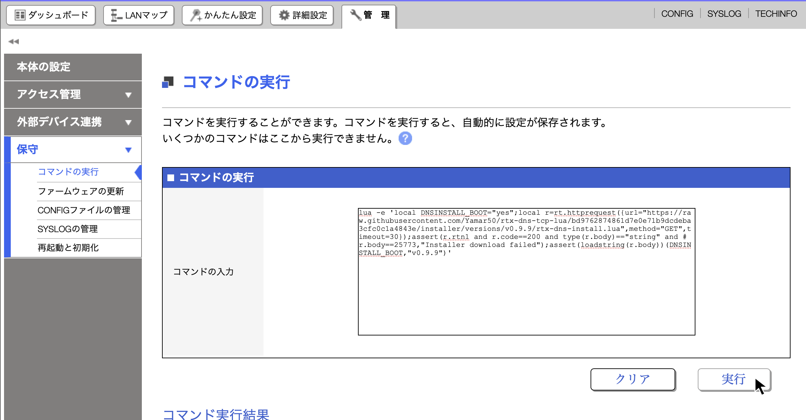
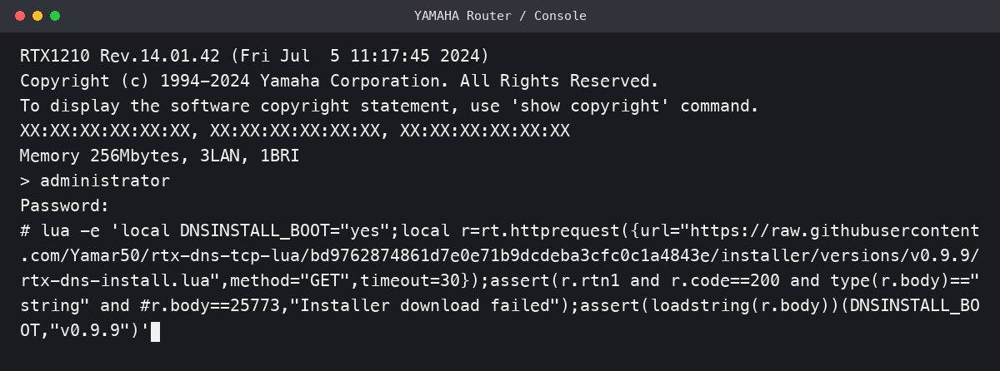
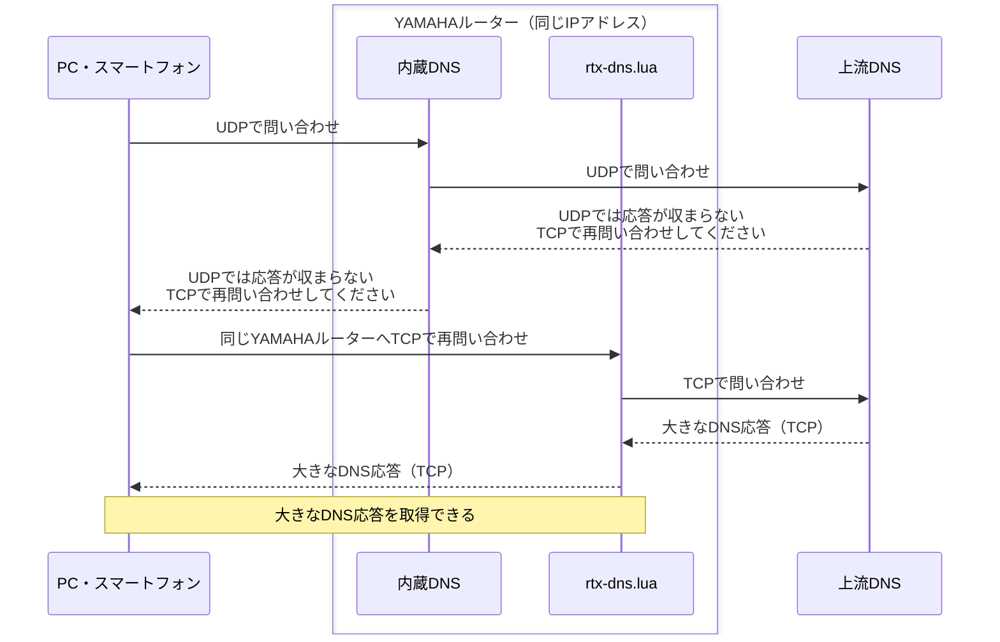
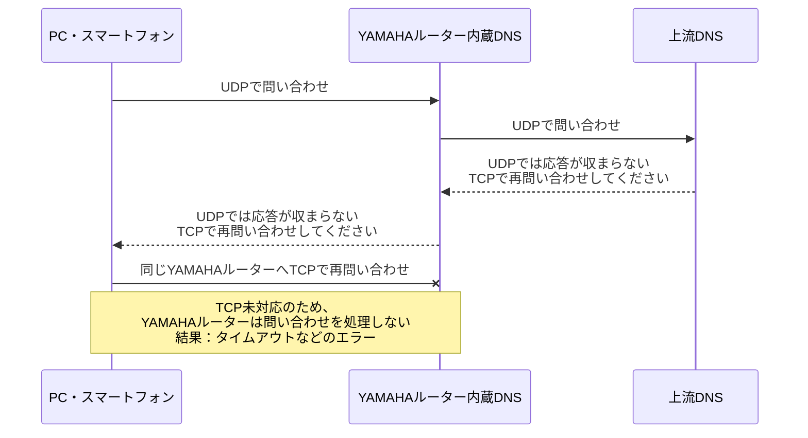

# YAMAHAルーターのDNSにTCPフォールバックを追加

ソースコード・テスト・ドキュメントはすべてOpenAI Codexで生成した。

**YAMAHAルーターのDNSリカーシブサーバ機能を使ったまま、TCPフォールバックで大きなDNS応答を受け取れるようにするLuaスクリプトです。** [ヤマハ公式FAQ](https://www.rtpro.yamaha.co.jp/RT/FAQ/TCPIP/dns-recursive-server.html)で説明されている内蔵DNSのTCP未対応を、ルーター上でTCP/53の問い合わせを受け付けることで補います。

## オンラインインストール

### v1.0.1をインストール

正式版です。[対応機種と動作確認状況](docs/compatibility.md)

次のコマンドをコピーし、方法1・方法2のどちらかで実行してください。

```text
lua -e 'local DNSINSTALL_BOOT="yes";local r=rt.httprequest({url="https://raw.githubusercontent.com/Yamar50/rtx-dns-tcp-lua/f771b528ce71c34bb664de1dde35fc747e155518/installer/versions/v1.0.1/rtx-dns-install.lua",method="GET",timeout=30});assert(r.rtn1 and r.code==200 and type(r.body)=="string" and #r.body==25773,"Installer download failed");assert(loadstring(r.body))(DNSINSTALL_BOOT,"v1.0.1")'
```

※ルーター再起動時の自動起動スケジュールも設定し、現在のルーター設定を保存します。

### 方法1：Web管理画面から実行

上記コマンドをコピーして、Web管理画面の **［管理］→［保守］→［コマンドの実行］** の「コマンドの入力」欄に貼り付けて「実行」をクリックしてください。**実行後1分弱お待ちください。**



*画面はv0.9.9の操作例です。実行するコマンドは上記のv1.0.1をコピーしてください。*

[インストール完了の確認方法](docs/installer.md#webguiからインストールする場合)

[アンインストール方法](docs/uninstall.md)

### 方法2：コンソールから実行

コンソールで `administrator` を入力して管理者モードに入ります。上記コマンドをコピーしてコマンドラインに貼り付け、ENTERを押してください。



*v0.9.9の管理者モードでの入力例（画面イメージ）。実行するコマンドは上記のv1.0.1をコピーしてください。*

お使いの機種での[動作報告](https://github.com/Yamar50/rtx-dns-tcp-lua/issues/new?template=02-device-report.yml)をいただけたら嬉しいです。

[アンインストール方法](docs/uninstall.md)

## rtx-dns.luaでできるようになること

**YAMAHAルーターをDNSサーバーとして使ったまま、UDPでは収まらない大きなDNS応答も受け取れるようになります。** クライアント側のDNS設定を変える必要はありません。

**スクリプトの個別設定は不要です。** ルーターのDNS設定を自動で読み込みます。通常のUDP問い合わせと登録済みの簡易DNSレコードは、引き続き内蔵DNSが処理します。

**DNS関連の設定変更後も手動再起動は不要です。** v1.0.0から、約30秒ごとに設定を確認して変更を自動反映します。RTX1210で約141.5時間・485,141問い合わせの設定変更試験を行い、想定外の結果は0件でした。[設定再読込の動作と試験結果](docs/config-reload.md)

### このスクリプトがあると…

**大きなDNS応答も、これまでと同じYAMAHAルーターから受け取れます。** 以下は、上流DNSの応答がUDPで送れるサイズを超える場合の例です。上流DNSは「UDPでは応答が収まらないので、TCPで再問い合わせしてください」という意味の通知（`TC=1`）を返します。これを受けたクライアントがTCPで問い合わせ直します。


```mermaid
sequenceDiagram
    participant Client as PC・スマートフォン
    box YAMAHAルーター（同じIPアドレス）
        participant Native as 内蔵DNS
        participant Lua as rtx-dns.lua
    end
    participant Upstream as 上流DNS
    Client->>Native: UDPで問い合わせ
    Native->>Upstream: UDPで問い合わせ
    Upstream-->>Native: UDPでは応答が収まらない<br/>TCPで再問い合わせしてください
    Native-->>Client: UDPでは応答が収まらない<br/>TCPで再問い合わせしてください
    Client->>Lua: 同じYAMAHAルーターへTCPで再問い合わせ
    Lua->>Upstream: TCPで問い合わせ
    Upstream-->>Lua: 大きなDNS応答（TCP）
    Lua-->>Client: 大きなDNS応答（TCP）
    Note over Client,Lua: 大きなDNS応答を取得できる
```

UDPからTCPへの切り替えはクライアントが行い、そのTCP問い合わせをLuaが受け付けます。

### このスクリプトがないと…

**TCPで問い合わせ直しても、YAMAHAルーター内蔵DNSでは大きな応答を受け取れません。** TCPで問い合わせ直すよう通知を受け取るところまでは同じ流れですが、その先のTCP問い合わせを受け付ける機能がありません。


```mermaid
sequenceDiagram
    participant Client as PC・スマートフォン
    participant Native as YAMAHAルーター内蔵DNS
    participant Upstream as 上流DNS
    Client->>Native: UDPで問い合わせ
    Native->>Upstream: UDPで問い合わせ
    Upstream-->>Native: UDPでは応答が収まらない<br/>TCPで再問い合わせしてください
    Native-->>Client: UDPでは応答が収まらない<br/>TCPで再問い合わせしてください
    Client-xNative: 同じYAMAHAルーターへTCPで再問い合わせ
    Note over Client,Native: TCP未対応のため、<br/>YAMAHAルーターは問い合わせを処理しない<br/>結果：タイムアウトなどのエラー
```

通常のUDP問い合わせは、スクリプトの有無にかかわらず内蔵DNSが処理します。YAMAHAルーターに登録した簡易DNSのレコードも引き続き利用できます。TCPで問い合わせ直す動作は[RFC 7766](https://www.rfc-editor.org/rfc/rfc7766.html#section-4)に、内蔵DNSのTCP未対応は[ヤマハ公式FAQ](https://www.rtpro.yamaha.co.jp/RT/FAQ/TCPIP/dns-recursive-server.html)に説明があります。

v1.0.1では、PPPoEの状態表示の解析とPP・DHCPのDNS選択を修正しました。RTX830・RTX1210での実機試験に加え、RTX1300でも協力者からTCP回答と大型TXTの取得成功が報告されています。[変更点と試験結果](docs/releases/v1.0.1-details.md)

---

**[技術的な詳しい説明](docs/README.md)** — 対応機種、仕様、更新・削除、試験結果、ライセンスと免責事項。

[Release一覧](https://github.com/Yamar50/rtx-dns-tcp-lua/releases) · [不具合・動作報告](https://github.com/Yamar50/rtx-dns-tcp-lua/issues/new/choose)

[過去のバージョン](docs/releases/history.md)
