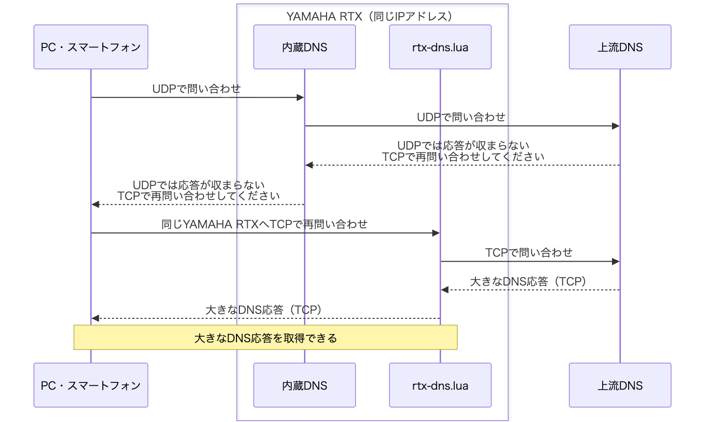
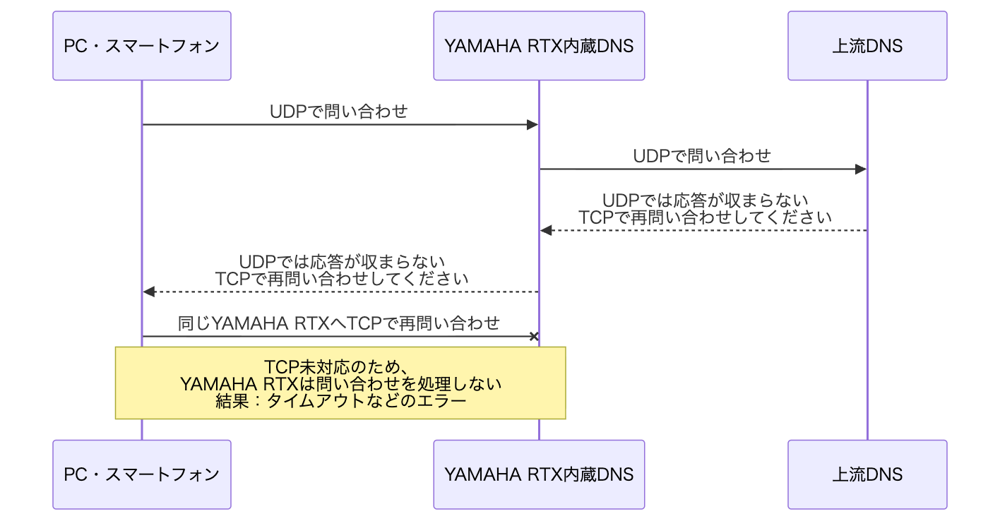

ソースコード・テスト・ドキュメントはすべてOpenAI Codexで生成した。

# v0.1.4 — レコード数の多いDNS応答の送信タイムアウトを修正

**約4,000件のAレコードを含む約64KBの応答で、応答を送る前に接続が閉じる問題を修正しました。** 送信期限は既定の2秒を維持し、応答の準備が完了した時点から計算します。

## YAMAHAのRTXルーターのDNSにTCPフォールバックを追加

**YAMAHA RTXをDNSサーバーとして使ったまま、UDPでは収まらない大きなDNS応答も受け取れるようにするLuaスクリプトです。** クライアント側のDNSサーバー設定を変えずに使えます。

- **TCPフォールバックに対応**：クライアントがUDPからTCPへ切り替えた問い合わせを、同じYAMAHA RTXのIPアドレスで受け付けます。[ヤマハ公式FAQで説明されている内蔵DNSのTCP未対応](https://www.rtpro.yamaha.co.jp/RT/FAQ/TCPIP/dns-recursive-server.html)を補います。
- **インストールは簡単**：配布ファイルの`rtx-dns.lua`をYAMAHA RTXへ転送し、起動コマンドを実行するだけ。追加ライブラリやビルドは不要です。自動起動もスケジュールコマンドで登録できます。
- **スクリプトの個別設定は不要**：上流DNS、問い合わせを許可する端末・LAN、簡易DNSの登録内容を、起動時にYAMAHA RTXの設定から自動で読み込みます。Luaファイルを編集する必要はありません。
- **既存の内蔵DNSと共存**：通常のUDP問い合わせは従来どおり内蔵DNSが処理します。登録済みの簡易DNSレコードも内蔵DNSへ問い合わせ、スクリプトがYAMAHA RTXの設定を書き換えることはありません。

[rtx-dns.luaをダウンロード](https://github.com/Yamar50/rtx-dns-tcp-lua/releases/download/v0.1.4/rtx-dns.lua) · [インストール手順](https://github.com/Yamar50/rtx-dns-tcp-lua/blob/v0.1.4/docs/install.md)

### このスクリプトがあると…

**大きなDNS応答も、これまでと同じYAMAHA RTXから受け取れます。** 以下は、上流DNSの応答がUDPで送れるサイズを超える場合の例です。上流DNSは「UDPでは応答が収まらないので、TCPで再問い合わせしてください」という意味の通知（`TC=1`）を返します。これを受けたクライアントがTCPで問い合わせ直します。



UDPからTCPへの切り替えはクライアントが行い、そのTCP問い合わせをLuaが受け付けます。

### このスクリプトがないと…

**TCPで問い合わせ直しても、YAMAHA RTX内蔵DNSでは大きな応答を受け取れません。** TCPで問い合わせ直すよう通知を受け取るところまでは同じ流れですが、その先のTCP問い合わせを受け付ける機能がありません。



通常のUDP問い合わせは、スクリプトの有無にかかわらず内蔵DNSが処理します。YAMAHA RTXに登録した簡易DNSのレコードも引き続き利用できます。TCPで問い合わせ直す動作は[RFC 7766](https://www.rfc-editor.org/rfc/rfc7766.html#section-4)に、内蔵DNSのTCP未対応は[ヤマハ公式FAQ](https://www.rtpro.yamaha.co.jp/RT/FAQ/TCPIP/dns-recursive-server.html)に説明があります。

## 修正内容

| 項目 | v0.1.3 | v0.1.4 |
| --- | --- | --- |
| レコード数の多い応答 | 解析や加工に時間がかかると、古い時刻から計算した送信期限に達し、単発要求でも応答送信前に接続が閉じる場合がありました。 | 検証・加工・キャッシュ処理・TCPフレーム作成が完了してから時刻を取得し、送信期限を設定します。 |
| 送信期限 | 既定2秒 | 既定2秒を維持。部分送信や後続応答によって先行応答の期限を延長しません。 |

キャッシュTTL、上流問い合わせの期限、接続数・問い合わせ数制限は変更していません。TCP/53の自動設定、簡易DNSへの委譲、`dns server select`、PP・DHCPで取得したDNS情報の30秒更新も引き続き利用できます。

2秒は**応答準備完了後の送信期限**であり、解析時間などを含む総応答時間の上限ではありません。

## 実機確認

**YAMAHA RTX830 Rev.15.02.33とYAMAHA RTX1210 Rev.14.01.42で、各29項目・合計58項目の回帰試験に成功しました。** いずれも整数版Lua 5.1.5（機能1.08）です。

| 試験 | YAMAHA RTX830 | YAMAHA RTX1210 |
| --- | --- | --- |
| 4,000件のAレコード・64,067バイト、新規接続で単発5回 | 5/5成功、全バイト一致 | 5/5成功、全バイト一致 |
| 同上の総応答時間 | 1.612–2.519秒 | 2.580–4.922秒 |
| 65,535バイトの応答 | 全バイト一致 | 全バイト一致 |
| キャッシュ、TCP半閉鎖、アクセス・接続数・クエリ数制限、異常応答の拒否、SERVFAILと障害復帰 | 成功 | 成功 |

常用ファイルへ配置したものを指紋検証し、同じモジュールを別の試験用ポートで動かして合成応答を確認しました。常用53番ポートでも、外部A・AAAA・TXT、簡易DNSのA/CNAME/PTR、DNS選択ルール、UDP→TCPへの切り替えの16件が成功しました。追加配備時の36件もすべて成功しています。後者は同じ装置を一部含む運用確認で、別の負荷試験ではありません。

ホスト上の全Luaスイート（リレー62ケースを含む）とPython17テストも成功しました。公開用に再ビルドしたファイルは、実機に配備したファイルと全バイト一致しています。

同じような重い応答を複数同時に処理すると、上流応答の待ち期限に達してSERVFAILになる性能上の制約は残ります。v0.1.4で最大負荷・長時間運転・PP/DHCP再接続の試験は再実施していません。[検証条件と結果](https://github.com/Yamar50/rtx-dns-tcp-lua/blob/v0.1.4/docs/validation.md#v014-validation)・[既知の問題](https://github.com/Yamar50/rtx-dns-tcp-lua/blob/v0.1.4/docs/known-issues.md)

YAMAHA RTX1300 Rev.23.00.19は、協力者から**v0.1.2**での動作確認報告があります。v0.1.4の実機検証には含めていません。YAMAHA RTX810は未検証です。

## インストール・更新

USBメモリやmicroSDカード、SFTP等でインストールします。以下はUSBメモリを使う例です。

1. ReleaseのAssetsから`rtx-dns.lua`と`SHA256SUMS`をダウンロードします。転送前のSHA-256を確認し、LuaファイルをUSBメモリのルートへ保存します。
2. YAMAHA RTXへUSBメモリを接続します。管理者コンソールで`show file list /`を実行し、`/lua`がない場合だけ`make directory /lua`で作成します。
3. **更新時は、コピーする前に対象スクリプトを停止します。** 初回インストールでは停止操作は不要です。

```text
terminate lua file /lua/rtx-dns.lua
show status lua running
```

対象の停止を確認し、既存ファイルを別名で退避してから入れ替えます。次のコマンドは1行ずつ実行し、それぞれの終了を確認してください。

```text
copy usb1:/rtx-dns.lua /lua/rtx-dns.lua
luac -p /lua/rtx-dns.lua
```

構文エラーがなければ、別のコマンドとして起動します。

```text
lua /lua/rtx-dns.lua
show status lua running
show log
```

対象ファイルが動作中で、ログに`DNSRELAY`の起動記録があることを確認します。利用端末から通常の問い合わせと大きなTXT等のTCP問い合わせを行い、応答を確認してください。同じファイルを重複起動しないでください。

起動時にYAMAHA RTXの`dns host`、`ip host`・`dns static`、`dns server select`・`dns server`・`dns server pp`・`dns server dhcp`を読み取ります。`dns service off`など、サービスを開始できない設定では起動を中止します。

### YAMAHA RTX起動時の自動実行

新規導入時は、`100`を未使用のスケジュール番号に置き換えて登録します。**既存版からの更新では、登録済みの起動スケジュールをそのまま使えます。**

```text
schedule at 100 startup * lua /lua/rtx-dns.lua
save
```

手動起動済みなら、そのまま利用できます。まだ起動していない場合は`lua /lua/rtx-dns.lua`で開始するか、自動起動設定を保存してYAMAHA RTX本体を再起動します。更新のためにYAMAHA RTX本体を再起動する必要はありません。[詳しい導入手順](https://github.com/Yamar50/rtx-dns-tcp-lua/blob/v0.1.4/docs/install.md)

### 設定変更後の再起動

`dns host`、DNSサーバ設定・選択規則、`dns service`、簡易DNS登録名、対象インターフェースのIP等を変更したら、上記の停止・確認・起動手順でLuaを再起動してください。30秒更新の対象はPP・DHCPの取得情報と必要なPP接続状態で、configそのものではありません。同じ設定のまま取得DNSが変わった場合は、再起動不要です。

## 配布ファイル

| ファイル | 内容 |
| --- | --- |
| `rtx-dns.lua` | そのままYAMAHA RTXへ転送する自動設定版、143,094バイト |
| `SHA256SUMS` | 配布LuaのSHA-256チェックサム |

`rtx-dns.lua`のSHA-256：

```text
fae59a561a9a00aaa0b3c4529504cd14deec66439b49a35d1383bd4a9eec42ef
```

## ライセンスと免責事項

このリポジトリには、MITなどのソフトウェアライセンスを設定していません。

本ソフトウェアは現状のまま提供します。動作、正確性、特定の目的への適合性を保証しません。利用者自身の責任で使用してください。本ソフトウェアの使用または使用不能によって生じた損害について、提供者は法令で認められる範囲において一切の責任を負いません。
