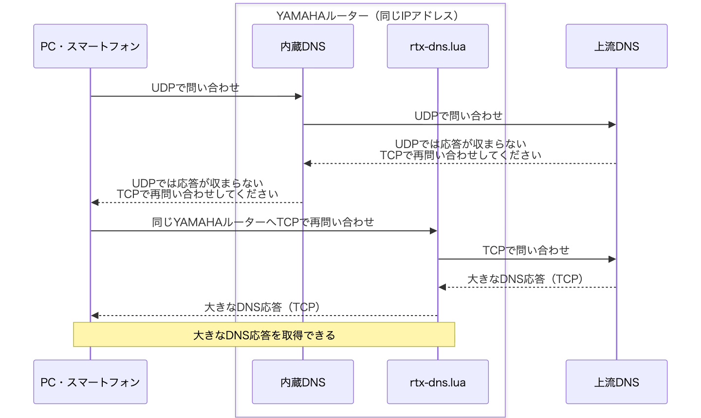
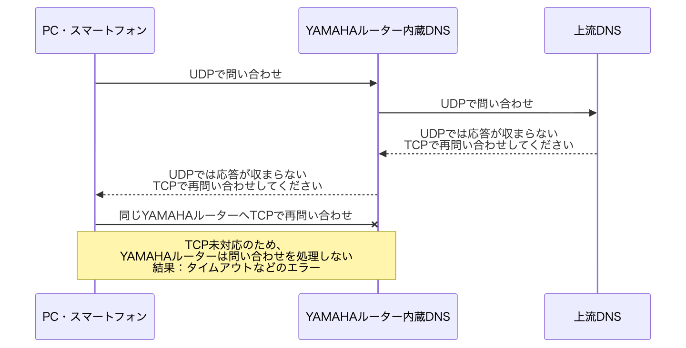

ソースコード・テスト・ドキュメントはすべてOpenAI Codexで生成した。

# YAMAHAルーターのDNSにTCPフォールバックを追加

**YAMAHAルーターをDNSサーバーとして使ったまま、UDPでは収まらない大きなDNS応答も受け取れるようにするLuaスクリプトです。** クライアント側のDNSサーバー設定を変えずに使えます。

- **TCPフォールバックに対応**：クライアントがUDPからTCPへ切り替えた問い合わせを、同じYAMAHAルーターのIPアドレスで受け付けます。[ヤマハ公式FAQで説明されている内蔵DNSのTCP未対応](https://www.rtpro.yamaha.co.jp/RT/FAQ/TCPIP/dns-recursive-server.html)を補います。
- **インストールは簡単**：配布ファイルの`rtx-dns.lua`をYAMAHAルーターへ転送し、起動コマンドを実行するだけ。追加ライブラリやビルドは不要です。自動起動もスケジュールコマンドで登録できます。
- **スクリプトの個別設定は不要**：上流DNS、問い合わせを許可する端末・LAN、簡易DNSの登録内容を、起動時にYAMAHAルーターの設定から自動で読み込みます。Luaファイルを編集する必要はありません。
- **既存の内蔵DNSと共存**：通常のUDP問い合わせは従来どおり内蔵DNSが処理します。登録済みの簡易DNSレコードも内蔵DNSへ問い合わせ、スクリプトがYAMAHAルーターの設定を書き換えることはありません。


## 動作が見込まれる機種と動作確認状況

**RTX・NVR・vRXシリーズに加え、FWX120も対象です。** [ヤマハ公式Lua機能対応表](https://www.rtpro.yamaha.co.jp/RT/docs/lua/index.html)とリリースノートを基に、必要なAPIを備える17機種・提供環境をまとめました。最低ファームウェアはAPIの条件で、実機確認した版とは別に記載しています。

| 機種・提供環境 | 最低ファームウェア（API条件） | 動作確認したファームウェア | 確認したスクリプト | 動作確認状況 |
|---|---|---|---|---|
| RTX840 | Rev.23.02.02 | — | — | 情報をお待ちしております |
| RTX3510 | Rev.23.01.01 | — | — | 情報をお待ちしております |
| RTX1300 | Rev.23.00.03 | Rev.23.00.19 | v0.1.2 | 協力者から動作報告あり |
| RTX1220 | Rev.15.04.01 | — | — | 情報をお待ちしております |
| RTX830 | Rev.15.02.01 | Rev.15.02.33 | v0.9.9 | 開発時に機能・負荷試験を実施。5台への配備を確認 |
| RTX1210 | Rev.14.01.11 | Rev.14.01.42 | v0.9.9 | 開発時に機能・負荷試験を実施。1台への配備を確認 |
| RTX5000 | Rev.14.00.18 | — | — | 情報をお待ちしております |
| RTX3500 | Rev.14.00.18 | — | — | 情報をお待ちしております |
| RTX810 | Rev.11.01.25 | — | — | 情報をお待ちしております |
| RTX1200 | Rev.10.01.65 | — | — | 情報をお待ちしております |
| NVR510 | Rev.15.01.02 | Rev.15.01.26 | v0.1.4-nvr.1＋PR #1の追加修正（`9402afc`） | 協力者から外部A・大型TXT・内蔵DNSの名前解決の動作報告あり |
| NVR700W | Rev.15.00.02 | — | — | 情報をお待ちしております |
| NVR500 | Rev.11.00.28 | — | — | 情報をお待ちしております |
| FWX120 | Rev.11.03.13 | — | — | 情報をお待ちしております |
| vRX VMware ESXi版 | Rev.20.01.03 | — | — | 情報をお待ちしております |
| vRX Amazon EC2版 | Rev.20.00.03 | — | — | 情報をお待ちしております |
| vRX さくらのクラウド版 | Rev.19.02.10 | — | — | 情報をお待ちしております |

**v0.9.9を実機検証した機種はRTX830・RTX1210です。** RTX1300とNVR510の報告は、表に記載した過去版・修正版に対するものです。負荷試験の条件と結果、機種ごとの制約、最低ファームウェアの根拠は[対応機種の管理表](../compatibility.md)を参照してください。

### 検出するインターフェース名

**不具合の報告や「この機種で動いた」という動作報告をいただけると嬉しいです。** [GitHub Issues](https://github.com/Yamar50/rtx-dns-tcp-lua/issues/new/choose)から「不具合の報告」または「動作の報告」を選んで、分かる範囲でご記入ください。

| 種類 | 検出する形式 | 例 |
|---|---|---|
| LAN | `lanN` | `lan1`、`lan2` |
| タグVLAN | `lanN/M` | `lan1/1` |
| LAN分割 | `lanN.M` | `lan1.1` |
| VLAN | `vlanN` | `vlan1` |
| WAN | `wan1` | `wan1` |
| ONU | `onu1` | `onu1` |
| ブリッジ | `bridge1` | `bridge1` |
| PP | `pp N`（専用構文） | `dns server pp 1` |

`N`・`M`は番号です。名前を検出できることと、各DNSコマンドで使えることは別です。たとえば`lanN.M`はアドレス読取りと`dns host lan`の対象に含めますが、直接の`dns host lanN.M`やDHCPによるDNS取得元には対応していません。詳しくは[用途別の対応表](../compatibility.md#interface-forms)を参照してください。

**一覧にないインターフェース名を使用していて、起動や名前解決に失敗する場合は、[GitHub Issues](https://github.com/Yamar50/rtx-dns-tcp-lua/issues)でお知らせください。Luaコードを調べたり修正したりする必要はありません。** GitHubにログインし、**Issues → New issue**で報告の種類を選び、フォームに記入して送信できます。 機種名・ファームウェアRev.・スクリプトの版・`DNSRELAY`のエラーログ・該当するDNS設定行を添えてください。パスワードなどの認証情報は記載せず、IPアドレスやホスト名も必要に応じて伏せてください。起動失敗にはAPIやアクセス許可設定など別の原因もあるため、一覧内の名前で失敗する場合も同じ情報が役立ちます。

## インストール・更新手順

USBメモリやmicroSDカード、SFTP等でインストールします。機種が備える転送方法を使用してください。以下はUSBメモリを使う例です。

1. ReleaseのAssetsから`rtx-dns.lua`と`SHA256SUMS`をダウンロードし、SHA-256を確認します。LuaファイルをUSBメモリのルートへ保存し、ルーターへ接続します。
2. `/lua`が存在しない場合だけ`make directory /lua`で作成します。
3. **更新時は、上書きする前に対象スクリプトを停止します。** 初回インストールでは停止操作は不要です。

```text
terminate lua file /lua/rtx-dns.lua
show status lua running
```

**NVR試験版`nvr-dns.lua`から移行する場合は、コピー前にそのLuaタスクも停止し、旧ファイルを起動するスケジュールを解除します。** 詳細は[移行手順](../install.md#nvr-migration)を参照してください。

停止を確認し、既存ファイルを必要に応じて別名で退避してからコピーします。各コマンドは1行ずつ実行し、終了を確認してください。

```text
copy usb1:/rtx-dns.lua /lua/rtx-dns.lua
luac -p /lua/rtx-dns.lua
```

構文エラーがなければ起動します。

```text
lua /lua/rtx-dns.lua
show status lua running
show log
```

`DNSRELAY`の起動記録を確認し、利用端末から通常の問い合わせと大きなTXT等のTCP問い合わせを確認します。同じファイルを重複起動しないでください。

### ルーター起動時の自動実行

初回は`100`を未使用のスケジュール番号へ置き換えます。更新時は既存のスケジュールをそのまま使用できます。

```text
schedule at 100 startup * lua /lua/rtx-dns.lua
save
```

手動起動済みならそのまま利用できます。更新にルーター本体の再起動は不要です。[詳しい導入手順](../install.md)

## このスクリプトがあると…

**大きなDNS応答も、これまでと同じYAMAHAルーターから受け取れます。** 以下は、上流DNSの応答がUDPで送れるサイズを超える場合の例です。上流DNSは「UDPでは応答が収まらないので、TCPで再問い合わせしてください」という意味の通知（`TC=1`）を返します。これを受けたクライアントがTCPで問い合わせ直します。



UDPからTCPへの切り替えはクライアントが行い、そのTCP問い合わせをLuaが受け付けます。

## このスクリプトがないと…

**TCPで問い合わせ直しても、YAMAHAルーター内蔵DNSでは大きな応答を受け取れません。** TCPで問い合わせ直すよう通知を受け取るところまでは同じ流れですが、その先のTCP問い合わせを受け付ける機能がありません。



通常のUDP問い合わせは、スクリプトの有無にかかわらず内蔵DNSが処理します。YAMAHAルーターに登録した簡易DNSのレコードも引き続き利用できます。TCPで問い合わせ直す動作は[RFC 7766](https://www.rfc-editor.org/rfc/rfc7766.html#section-4)に、内蔵DNSのTCP未対応は[ヤマハ公式FAQ](https://www.rtpro.yamaha.co.jp/RT/FAQ/TCPIP/dns-recursive-server.html)に説明があります。

## v0.9.9 — 機種ごとの設定差への対応とIPv6のみのDNS規則の切替

**YAMAHA NVRのONUやタグVLANなどのインターフェース名を共通で扱い、IPv6のみのDNS規則から、条件に合うIPv4 DNSを選べるようにしました。** 機種ごとにスクリプトを分けず、共通の`rtx-dns.lua`を使用します。

v0.9.9は、v1.0.0に向けて複数機種での通常利用を確認するための版です。

### 主な変更点

| 項目 | v0.9.9の動作 |
|---|---|
| 機種ごとのインターフェース名 | `lanN`・`lanN/M`・`lanN.M`・`vlanN`・`wan1`・`onu1`・`bridge1`を共通で分類し、用途ごとに判定します。PPは専用構文で扱います。 |
| IPv6のみの上流規則 | 条件に一致した規則のDNSがIPv6のみと確定した場合、条件に合う後続select、次に通常DNSのIPv4を使います。 |
| 未対応のDNS取得元 | 選択条件を解釈できる場合、該当する問い合わせだけをSERVFAILにします。無関係な規則の問い合わせは継続します。 |
| PDPの識別 | NVRの`pdp wan1`は未対応取得元として識別します。通常設定の優先順位を保持し、下位DHCPへ勝手に切り替えません。PDPからのDNS取得自体は追加していません。 |
| 必須APIと異常時の処理 | 必要なAPIを確認し、初期化失敗時にソケットを解放します。ログ出力の失敗で元の処理エラーを隠さず、待機できない場合は停止してCPUの空回りを防ぎます。 |
| 内蔵DNSへのUDP問い合わせ | 公式APIに合わせて受信上限を2,048バイトとし、EDNSがある要求は2,048を超える広告サイズだけ縮小します。不完全な応答やTC=1はSERVFAILにします。 |

### IPv6のみのDNSが設定されている場合

1. IPv6のみで利用できない規則を除外し、条件に合う後続のselect規則を探します。
2. 見つからなければ、通常DNSに利用可能なIPv4があれば使います。
3. それでも問い合わせできなければSERVFAILを返します。

DNS取得状態が不明な規則、未対応の設定や選択条件、NAT46、明示的な拒否は、この読み飛ばしの対象にしません。同じ規則に利用可能なIPv4があればそのIPv4を使います。IPv4 DNSを選んだ後の接続拒否・タイムアウトは、従来どおり選んだ規則内で再試行し、別の規則へは切り替えません。

通常DNSは、固定の`dns server`、`dns server pp`、NVRの`dns server pdp`、`dns server dhcp`の優先順です。PDPが選ばれる場合は取得未対応のためSERVFAILです。通常の固定DNSがIPv6のみであることを理由に、さらに通常PPやDHCPへ選び直す処理はありません。

**IPv6で通信する機能の追加ではありません。** 待受と上流TCPはIPv4です。AAAAレコードもIPv4経由で問い合わせできます。内蔵DNSがIPv6側のDNS、LuaがIPv4側のDNSを使う場合、上流DNSによって回答やフィルタリング結果が異なることがあります。[DNS選択の技術仕様](../dns-ipv6-fallback.md)

### 更新時に確認する変更

- `dns host lan`にはLAN・タグVLAN・LAN分割・VLAN・bridgeを含み、WAN・ONUは含めません。
- **直接の`dns host lanN.M`は、公式DNS構文での受理を確認できていないため起動を中止します。** 従来のパーサーでは受理していました。LAN分割のアドレス読取りと`dns host lan`の集合には引き続き含めます。直接のDHCP DNS取得元にも`lanN.M`は含めません。
- 内蔵DNSへのローカルUDP問い合わせでは、完全な応答を受信できない場合にSERVFAILを返します。登録名を外部DNSへ送ったり、自分自身のTCP/53へ再問い合わせしたりしません。外部上流のTCP応答上限65,535バイトは維持します。

[インターフェース名と用途](../compatibility.md#interface-forms)・[DNS設定の選択と定期更新](../dns-policy.md)

### 維持する設定と運用

追加ライブラリやLuaファイルの手編集は不要です。起動時にYAMAHAルーターの設定から上流DNS、アクセス許可、簡易DNS登録名を読み取ります。通常のUDP問い合わせは引き続き内蔵DNSが処理し、このスクリプトがルーターのconfigを書き換えることはありません。

キャッシュ256件・本文1MiB、全体32接続、送信元IP当たり4接続・平均20クエリ/秒・バースト40件、応答準備完了後の送信期限2秒は変更していません。これらは保護のための既定値で、機種共通の性能上限を意味しません。

PP・DHCPの取得DNSと必要なPP接続状態は30秒ごとに確認します。configそのものは自動再読込しません。`dns host`、DNS選択規則、簡易DNS登録名、インターフェース設定などを変更した後はLuaを再起動してください。

### 対応機種と検証状況

[対応機種の管理表](../compatibility.md)は、ヤマハ公式Lua機能対応表とリリースノートから、現在使用するAPIで動作が見込まれる17機種・提供環境をまとめたものです。最低ファームウェア、開発時の実機検証、協力者からの報告を別に記載しています。動作情報のない機種は「情報をお待ちしております」としています。

v0.9.9は、YAMAHA RTX830 Rev.15.02.33・YAMAHA RTX1210 Rev.14.01.42で下表の機能試験に成功しました。YAMAHA RTX1300 Rev.23.00.19はv0.1.2、YAMAHA NVR510 Rev.15.01.26はv0.1.4-nvr.1にPR #1の修正を加えた版に対する協力者の報告です。他機種の過去版の報告をv0.9.9の実機確認として扱いません。NVR510の報告を受けて作成した今回のIPv6切替処理は、利用不能規則を広く読み飛ばすPRとは異なります。

| v0.9.9の試験 | YAMAHA RTX830 | YAMAHA RTX1210 |
|---|---|---|
| ネイティブLuaでの設定・状態解析 | 7スイート、2,738チェック成功 | 7スイート、2,738チェック成功 |
| 別ポートの実ソケットによる機能回帰 | 32/32項目成功 | 32/32項目成功 |
| 実際のconfigからの自動設定・TCP名前解決 | 8/8件成功 | 8/8件成功 |
| 最大65,535バイトのTCP応答 | 全バイト一致 | 全バイト一致 |
| Aレコード4,000件・64,067バイト、新規単発接続5回 | 5/5成功、全バイト一致 | 5/5成功、全バイト一致 |
| 内蔵DNS向けUDPの2,048バイト境界、EDNS縮小、TC時SERVFAIL | 成功 | 成功 |

試験対象はコミット`779e947`から生成した共通ファイルです。機能回帰は専用のTCP/53053とLAN内の合成DNSを使用し、既定の接続数・問い合わせ数制限と送信期限2秒を維持しました。解析試験は実際のLua上で合成config・状態表示を入力しています。実configの8件は、RAM試験内で自動設定の待受ポートだけを53053へ変え、既存のDNS経路を使って確認しました。実際のIPoE・PPPoE併用回線によるDNS取得やIPv6通信を検証したものではありません。

その後、同じ配布ファイルをRTX830の5台とRTX1210の1台へ通常のTCP/53で配備しました。外部A・AAAA・大型TXT、UDPからTCPへの再問い合わせ、簡易DNS登録名、拒否動作、5つの仮想IPからの利用を含め、計75/75件の確認に成功しています。ルーターの設定と既存の起動スケジュールを維持して更新しました。この配備確認を、PPの再接続や実際のIPoE・PPPoE併用回線の試験としては扱いません。

### 通常の配布版と限界負荷試験の違い

**再起動が発生したのは、通常の配布版の送信元IPごとの保護制限を大幅に緩めた限界負荷試験です。**

| 制限 | 通常の配布版 | 限界負荷試験 |
|---|---:|---:|
| IP当たりの同時TCP接続 | 4 | 32 |
| IP当たりの平均クエリ数/秒 | 20 | 1,000 |
| IP当たりのバースト件数 | 40 | 1,000 |
| 全体の同時TCP接続 | 32 | 32（変更なし） |

常用v0.1.4と試験用v0.9.9を並行稼働させたRTX830で、65,535バイト・予定160クエリ/秒の段階に自己再起動が1回発生しました。すべての制限を撤廃したわけではありませんが、単一の送信元から通常より高い負荷をかける設定です。**配布ファイルにはこの制限緩和を適用していません。** 原因は未確定として記録し、追加の原因究明は終了しています。[負荷試験記録](../load-test-v0.9.9.md)・[v0.9.9の検証記録](../validation.md#v099-validation)

追加試験では、既定の送信元制限を維持したRTX830の3台とRTX1210の1台で、最大長応答の毎秒20件・30秒間の全件成功と、毎秒160件での制限動作・その後の回復を確認しました。約5日連続稼働した別のRTX830で、制限を緩和した元の6段階を再実行しても再起動は観測していません。ただし初回の原因は未確定であり、修正済みとは扱いません。

### v1.0.0への進め方

既定制限を維持してv0.9.9を公開し、複数機種での通常利用の結果を確認します。問題がなければv1.0.0へ移行し、軽微な不具合が見つかった場合は修正してからv1.0.0とします。過負荷試験での再起動事象は記録に残し、追加の原因究明を移行の前提条件とはしません。

## 配布ファイル

| ファイル | 内容 |
|---|---|
| `rtx-dns.lua` | そのままルーターへ転送する自動設定版、150,764バイト |
| `SHA256SUMS` | 配布LuaのSHA-256チェックサム |

試験対象ファイルのSHA-256：

```text
c49daef597e0e56e0fb996750ddc4adca8c30e4927b0be3477d34f21e83ad453
```

このハッシュを、ダウンロードした配布ファイルの確認に使用できます。

## ライセンスと免責事項

このリポジトリには、MITなどのソフトウェアライセンスを設定していません。

本ソフトウェアは現状のまま提供します。動作、正確性、特定の目的への適合性を保証しません。利用者自身の責任で使用してください。本ソフトウェアの使用または使用不能によって生じた損害について、提供者は法令で認められる範囲において一切の責任を負いません。
